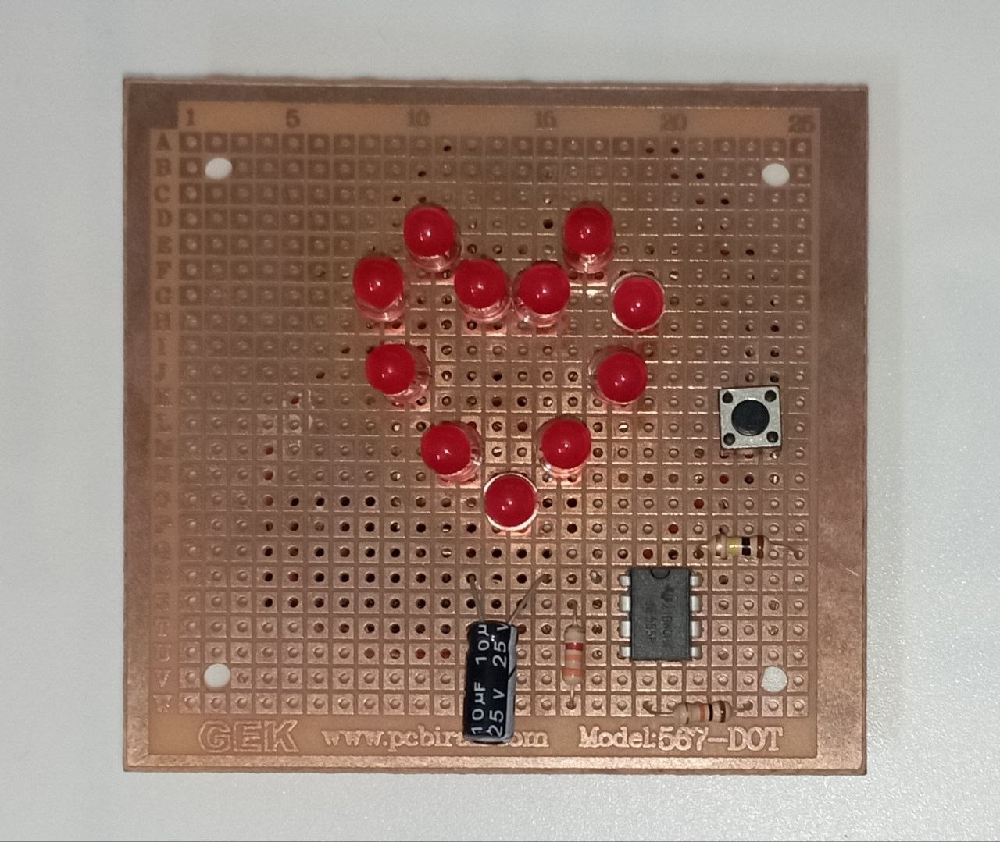

# ❤️ Pumping Heart with NE555
A heart-shaped LED circuit based on the NE555 timer IC. The schematic was designed in KiCad, and the circuit was physically assembled and tested on a perfboard.
## Project Photo

## Features
- ❤️ Heart-shaped LED design
- 🔴 Red LEDs ×11 
- ⏱️ NE555 Timer IC
- 🔋 Powered by a 9V battery
- 🛠️ Schematic designed in KiCad
- 🔧 Built on a perfboard 567-DOT 
- ✅ Fully assembled and tested
