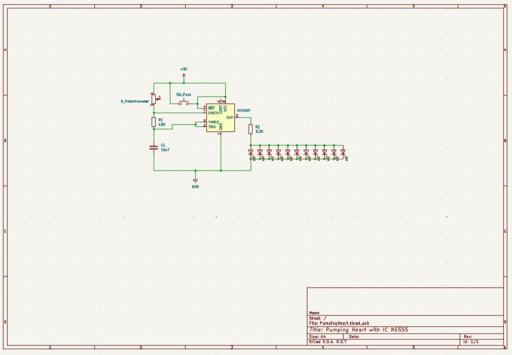

# ❤️ Pumping Heart with NE555
A heart-shaped LED circuit based on the NE555 timer IC. The schematic was designed in KiCad, and the circuit was physically assembled and tested on a perfboard.

  ## Project Photo

## 🔧 Components
| Component | Quantity |
|-----------|---------:|
| NE555 Timer IC | 1 |
| 5 mm Red LED | 11 |
| 10kΩ & 3.3kΩ Resistor | 1 | 
| 10uF Electrolytic Capacitor | 1 | 
| Push Button | 1 |
| 9V Battery | 1 |
| 9V Battery Clip | 1 |
| Perfboard | 1 |

## 📄 Schematic

---
## 🎥 Demo Video
Watch the project in action on Instagram:
https://www.instagram.com/reel/DZ0QzJlIRi4/?igsh=MWNmbDQyamxqZWV5Mg==
---

